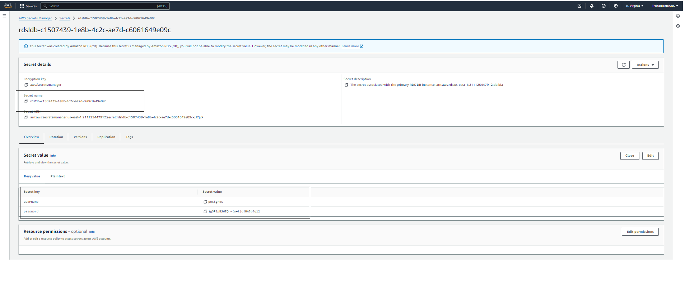
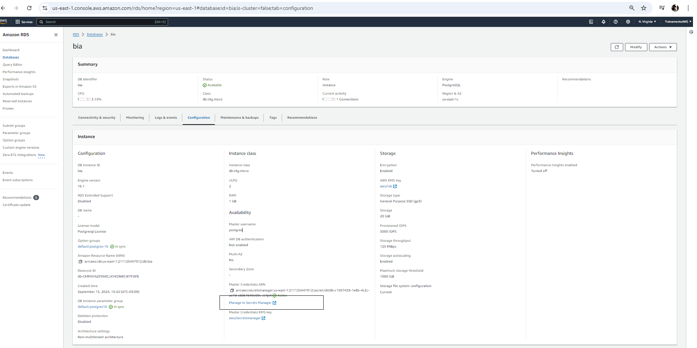
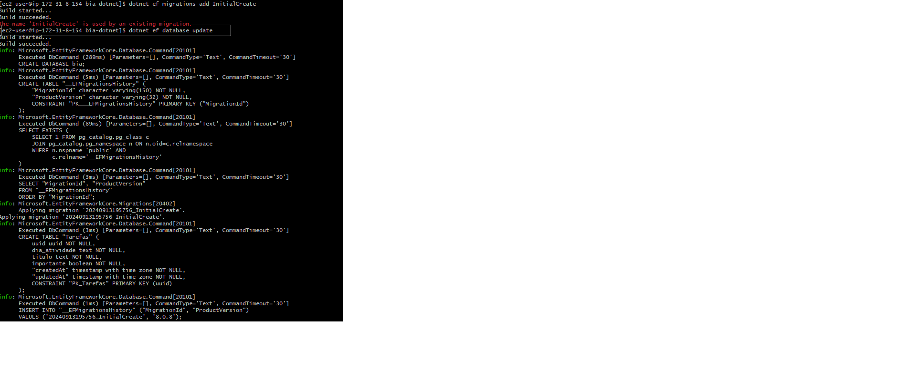
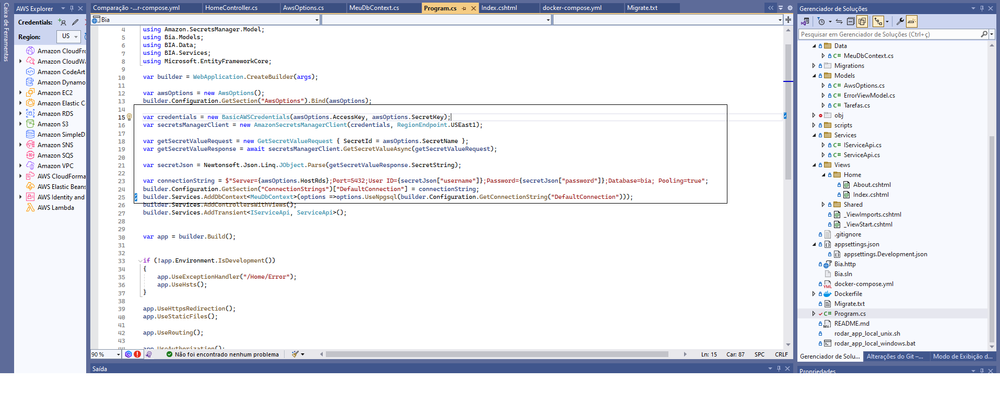
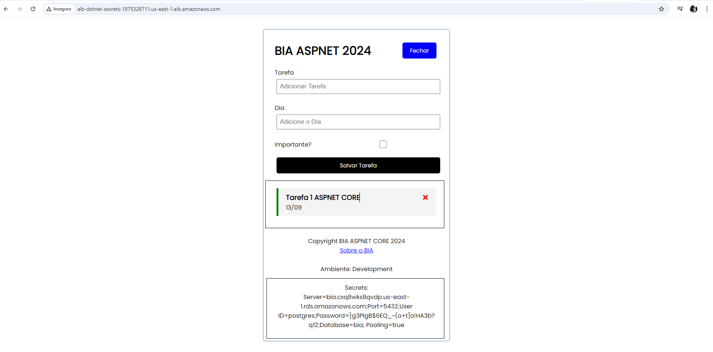

# Esse conteúdo faz parte da Formação AWS.

- Link para entrar para a Formação AWS: https://inscricao.formacaoaws.com.br

- Canal do Youtube: https://www.youtube.com/@henryllemaia

### Siga as orientacoes para rodar o seu projeto com docker

_Obs: Atente para a arquitetura da sua máquina, como é explicado na aula_ 


# Bia Bootcamp Imersão AWS 

Versão Adaptada de Node/React para .Net

# Ferramentas e bibliotecas do projeto

Segue algumas informações de quais ferramentas e importações você precisa ter 

1. Visual Studio
2. .NET Sdk 8.0
3. Microsoft.EntityFrameworkCore.Design
4. Npgsql.EntityFrameworkCore.PostgreSQL
5. Microsoft.EntityFrameworkCore
6. Docker
7. Git


## Setup

Comando para clonar o repositório e começar a usar.

```bash
git clone https://github.com/lleonnssilva/bia-dotnet.git
```


Iniciar o projeto com docker
```bash
docker compose up -d
```
Acessar
http://localhost:3001/

### Migrations

Rodar os migrations.

```bash
dotnet ef migrations add InitialCreate
dotnet ef database update
```
### Mais detalhes de migrations no arquivo Migrate.txt
- Máquina local X EntityFramework Migrations da solução
- Máquina local com RDS AWS X EntityFramework Migrations da solução
- Máquina local com Docker X Command psql
- RDS AWS com Bastion Host X EntityFramework Migrations da solução







